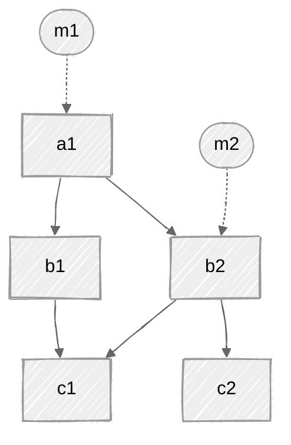
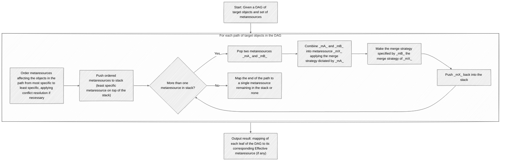
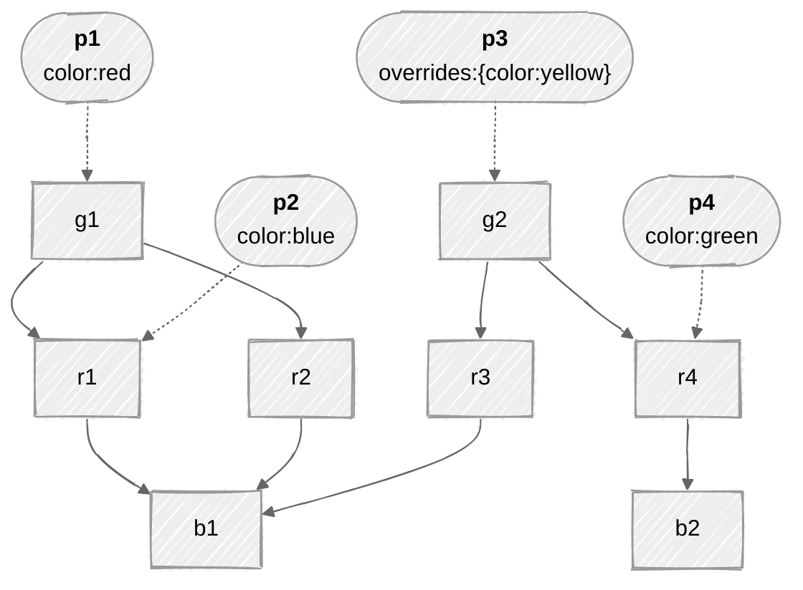

```mermaid
---
config:
  look: handDrawn
  theme: neutral
---
graph
  g1@{ shape: rect }
  r1@{ shape: rect }
  b1@{ shape: rect }
  p1@{ shape: stadium, label: "**p1**\ncolor:red\ncreationTimestamp:t" }
  p2@{ shape: stadium, label: "**p2**\ncolor:blue\ncreationTimestamp:t+Δ" }

  g1 --> r1
  r1 --> b1

  p1 -.-> b1
  p2 -.-> b1
```

# GEP-713: Metaresources and Policy Attachment

- Issue: [#713](https://github.com/kubernetes-sigs/gateway-api/issues/713)
- Status: Standard

(See status definitions [here](/geps/overview/#gep-states))

_XXX: These italicized XXX notes are me (Flynn) talking, not for publication_

The key words "MUST", "MUST NOT", "REQUIRED", "SHALL", "SHALL NOT", "SHOULD",
"SHOULD NOT", "RECOMMENDED", "MAY", and "OPTIONAL" in this document are to be
interpreted as described in [RFC 8174].

[RFC 8174]: https://datatracker.ietf.org/doc/html/rfc8174

## Overview and Concepts

There are places in Gateway API where we've wanted or needed to modify the _behavior_ of a resource without being able to modify the _definition_ of the resource: for example, we might want to specify rate limiting for a Kubernetes Service without being able to modify the definition of the Service resource itself. This GEP introduces the concept of a _metaresource_ to describe a class of resources intended only to augment the behavior of other objects and lays out guidelines for how to design and handle these resources in a standard way.

In contrast with most other GEPs, this GEP does _not_ specify a new API object or field. Instead, it specifies a _pattern_, defines a standard vocabulary for that pattern, and defines guidelines for implementations intending to use that pattern.

!!! warning
    It has become clear over time that GEP-713 metaresources can be _exceptionally_ difficult to implement and use correctly and effectively. It is RECOMMENDED that implementations SHOULD avoid using metaresources unless other implementations are not feasible. In particular, implementers SHOULD NOT use metaresources to implement features that [Ana] will frequently use. Implementers also SHOULD NOT use metaresources for features that can be cleanly expressed simply by modifying a Gateway API resource.

### User Stories

- [Ana] or [Chihiro] would like to specify some new for a standard Kubernetes resource, but that resource doesn't have a way to specify the behavior and neither Ana nor Chihiro can modify it.

  - For example, Ana may want to add a rate limit to a Kubernetes Service. The Service object itself doesn't have a field for rate limiting, and Ana can't modify the Service object's definition.

- A Gateway API implementer would like to define an implementation-specific behaviors for Gateway API objects that are already standard.

  - For example, an implementor might want to... _what? All the examples I can think of here are thinks we probably shouldn't encourage_.

- Chihiro would like a way to allow Ana to specify certain behaviors, but not others, in a very fine-grained way.

  - For example, Chihiro might want to allow Ana to specify rate limits for a Service, but not to specify the Service's ports.

- A Gateway API implementer would like to define a way to specify a behavior that applies to a whole hierarchy of objects.

  - For example, an implementer might want to define a way to specify a behavior that applies to all the HTTPRoutes in a Gateway.

[Ana]: ../../docs/concepts/roles-and-personas#ana
[Chihiro]: ../../docs/concepts/roles-and-personas#chihiro
[Ian]: ../../docs/concepts/roles-and-personas#ian

### Definitions

- _Metaresource_: a resource that augments the behavior of another resource without modifying the definition of the resource. Metaresources MUST clearly define a _target_ and an _intent_ as defined in this GEP, and MUST clearly communicate status about whether the augmentation is happening or not.

  - The _target_ of a metaresource specifies the resource or resources whose behavior the metaresource will augment.

  - The _intent_ of a metaresource specifies what augmentation the metaresource will apply.

  Metaresources are Custom Resource Definitions (CRDs) that comply with a particular structure. This structure includes standardized fields for specifying the target(s), metaresource-specific fields to describe the intended augmentation, and standardized status fields to communicate whether the augmentation is happening or not.

- _Policy_: a specific example of a metaresource whose intent is to specify rules that control the behavior of the target resource.

### Goals

- Establish a pattern for metaresources which MUST be used for any metaresources and policies included in the Gateway API spec, and MUST be used for any implementation-specific metaresources and policies used with Gateway API resources.
- Discuss the problems with communicating status for metaresource objects, and suggest mechanisms that APIs can use to mitigate some of them.
- Provide a way to distinguish between required and default values for all metaresource API implementations.
- Enable Policy Attachment at all relevant scopes in Gateway API, including Gateways, Routes, Backends, along with how values should flow across a hierarchy if necessary.
- Ensure the Policy Attachment specification is generic and forward thinking enough that it could be easily adapted to other grouping mechanisms like Namespaces in the future.
- Provide a means of attachment that works for both ingress and mesh implementations of Gateway API.
- Provide a consistent specification that will ensure familiarity between both included and implementation-specific metaresources so they can both be interpreted the same way.
- Provide a reference pattern to other implementations of metaresource and policy APIs outside of Gateway API that are based on similar concepts (i.e., augmenting the behavior of other Kubernetes objects, attachment points, nested contexts and inheritance, Defaults & Overrides, etc.)

### Non-Goals

- Define all potential metaresource and policy kinds that may be attached to resources.

## The Patterns

### Metaresources

As defined above, a metaresource is a CRD whose purpose is to augment the behavior of some other resource. At its most basic level, the metaresource pattern is:

- A user defines a metaresource describing both the target resource(s) they want to augment, and the intent of the augmentation
- The Gateway API implementation notices the metaresource and applies the intent to the target resource(s)
- The Gateway API implementation reports the status of the metaresource, indicating whether the intent is being applied or not

In the real world, of course, things are _much_ more complex. There may be multiple conflicting metaresources, or the user might attempt to apply a metaresource that they aren't allowed to, or there may be errors in the metaresources. The Gateway API implementation MUST be able to handle all of these cases, and MUST communicate status correctly in all situations.

Additionally, since this GEP defines a pattern rather than an API field or resource, it is not possible to enumerate all possible metaresources in this GEP. This means that metaresources MUST follow a well-known structure so that Gateway API users and implementations can work with them in a consistent way, and this GEP focuses on that well-known structure.

#### Metaresource Structure

A typical metaresource might look like:

```yaml
apiVersion: policies.controller.io/v1
kind: ColorPolicy
metadata:
  name: my-color-policy
spec:
  targetRefs: ## target objects whose behaviour to augment
    - group: gateway.networking.k8s.io/v1
      kind: Gateway
      name: my-gateway
  rules: ## the "spec proper" describing the intent, i.e. color the traffic blue
    color: blue
```

_(This is a hypothetical example: no ColorPolicy resource is defined in Gateway API.)_

- Every metaresource MUST include a `targetRefs` stanza specifying _which_ resource(s) the metaresource will augment.
- Every metaresource MUST include a `rules` stanza specifying _how_ the metaresource will augment the behavior of the target resource(s).
- A metaresource MAY include a `mergeStrategy` field specifying how the metaresource should be combined with other metaresources that affect the same target resource(s).

#### `targetRefs`

Metaresources MUST use the `targetRefs` stanza to specify one or more _target_ resources whose behavior the metaresource will augment. `targetRefs` is a list of objects with the following fields:

- `group`: the group of the target object (defaults to `gateway.networking.k8s.io`)
- `kind`: the kind of the target object (required, no default)
- `name`: the name of the target object (required, no default)

_XXX: I'm probably wrong about the above_

!!!warning
    The semantics of "targeting" a resource are complex and can vary widely depending on the resource being targeted and the metaresource being applied. For example, a metaresource that targets a Gateway might affect the Gateway itself, or it might affect all the Routes in the Gateway. Likewise, a metaresource targeting a namespace might actually affect all the HTTPRoutes in the namespace. Implementers MUST carefully consider the semantics of targeting a resource in their API design, and MUST communicate them clearly to the users. Users MUST be cautious in applying metaresources to ensure they understand the semantics of the target.

#### `rules`

The `rules` stanza specifies the _intent_ of the metaresource: that is, what behavior the metaresource will add to the target resource(s). The definition of the `rules` stanza is specific to each metaresource kind, though implementers SHOULD pay attention to prior art for similar metaresources.

#### `mergeStrategy`

_XXX: Obviously I'm making this up since this GEP doesn't say, anywhere that I can find, how to define the merge strategy?_

The merge strategy specifies how the metaresource should be combined with other metaresources that affect the same target resource(s). The merge strategy is a string that MUST be one of the following values:

...
...

Each metaresource kind MUST define a default merge strategy, and MAY allow users to specify a different merge strategy. If a user specifies a merge strategy that is not allowed by the metaresource kind, the implementation MUST reject the request with appropriate status: it MUST NOT accept the resource using the default merge strategy.

#### Status reporting

Metaresource implementations MUST communicate the status of metaresources to the end user using status conditions on both the metaresources, and SHOULD communicate status directly on the target resource(s).

##### Metaresource `status`

Metaresource CRDs MUST define a status stanza that allows for reporting the status of the metaresource with respect to each context the resource may apply. Metaresource implementations MUST support the following basic status conditions:

- **Accepted**: the metaresource passed both syntactic validation by the API server and semantic validation enforced by the controller, such as whether the target objects exist.
- **Enforced**: the metaresource’s spec is guaranteed to be fully enforced, to the extent of what the controller can ensure.
- **PartiallyEnforced**: parts of the metaresource’s spec is guaranteed to be enforced, while other parts are known to have been superseded by other specs, to the extent of what the controller can ensure. The status SHOULD include details highlighting which parts of the metaresource are enforced and which parts have been superseded, with the references to all other related metaresources.
- **Overridden**: the metaresource’s spec is known to have been fully overridden by other specs. The status SHOULD include the references to the other related metaresources.

Metaresource implementations MAY use additional status conditions to communicate more detailed information about the status of the metaresource, and MAY find that not all the above statuses are relevant to their implementation. However, an implementation that uses one of the above statuses MUST use it as defined here.

##### Target resource status

Implementations of metaresources SHOULD put a condition into `status.Conditions` of any target(s) affected by the metaresource. For target resources that don't have `status.Conditions` (such as Secret), implementations SHOULD use an annotation on the target resource to communicate the status.

The condition or annotation MUST be named according to the pattern `<controller-domain>/<meta-resource-kind>Affected`, and MUST have the optional `observedGeneration` field kept up to date when the spec of the target object changes. For example, repeating our hypothetical ColorPolicy example above:

```yaml
apiVersion: policies.controller.io/v1
kind: ColorPolicy
metadata:
  name: my-color-policy
spec: ...
```

the condition or annotation MUST be named along the lines of `colors.example.com/ColorPolicyAffected` where `colors.example.com` is a unique domain prefix for the controller that implements the ColorPolicy metaresource. (Implementations that also implement GatewayClass SHOULD use the same domain name as in the `controllerName` field on `GatewayClass`.)

### Policies and Policy Attachment

In many cases, the intent of a metaresource has to do with specifying rules that control the behavior of the target(s) -- for example, a metaresource targeting a networking resource might describe when to allow or block traffic at particular points of the network, or to mutate the traffic while it flows through the network at the point represented by the target object. Metaresources used in this way define _policies_, and _policy attachment_ is the process of using metaresources to apply policy.

The pattern of policy attachment is _exactly the same_ as the general metaresource pattern described above. The only difference is that the intent of the metaresource is to specify rules that control the behavior of the target resource(s).

## Managing metaresources in real life

Metaresources and policy attachment are extremely powerful and extremely flexible -- and, like every other similarly powerful mechanism, they can be _extremely_ difficult to use correctly. Implementers SHOULD NOT underestimate these challenges, and API designers SHOULD NOT underestimate the complexity of metaresources.

### Responsibility

Metaresources are typically implemented and managed by a custom controller. This controller can be the same controller that is responsible for managing the objects that are targeted by the metaresources or another controller specifically responsible for the aspect of the object that the metaresource augments or modifies. For policy kinds of metaresources, this controller is often referred to as the “policy controller”.

Ultimately, it is the responsibility of the controller to provide enough information to resource owners that help circumvent or mitigate the discoverability problem (described in the next section). This typically involves populating the status stanza of the target objects, although may as well resort to additional tools (e.g. CRDs, CLI tools) that help visualize the hierarchical topology of target objects and metaresources, effective metaresource specs, etc.

### The discoverability problem

A well-known problem of declaring specifications into separate objects, that ultimately will reshape or govern the behavior of their targeted ones, regards the discoverability of metaresources. That is, how an object owner gets to know what metaresource (or set of metaresources) is affecting their object and with what content.

Even though Kubernetes already has analogous problems in its core－the most obvious example being the Kubernetes Role Based Access Control (RBAC)－, the discoverability issue remains a challenging one to be addressed. To better understand it, consider the following parable described in the context of Gateway API, with thanks to [Flynn](mailto:flynn@buoyant.io):

#### The Parable

It's a sunny Wednesday afternoon, and the lead microservices developer for Evil Genius Cupcakes is windsurfing. Work has been eating Ana alive for the past two and a half weeks, but after successfully deploying version 3.6.0 of the `baker` service this morning, she's escaped early to try to unwind a bit.

Her shoulders are just starting to unknot when her phone pings with a text from Chihiro, down in the NOC. Waterproof phones are a blessing, but also a curse.

**Chihiro**: _Hey Ana. Things are still running, more or less, but latencies on everything in the `baker` namespace are crazy high after your last rollout, and `baker` itself has a weirdly high load. Sorry to interrupt you on the lake but can you take a look? Thanks\!\!_

Ana stares at the phone for a long moment, heart sinking, then sighs and turns back to shore.

What she finds when dries off and grabs her laptop is strange. `baker` does seem to be taking much more load than its clients are sending, and its clients report much higher latencies than they’d expect. She doublechecks the Deployment, the Service, and all the HTTPRoutes around `baker`; everything looks good. `baker`’s logs show her mostly failed requests... with a lot of duplicates? Ana checks her HTTPRoute again, though she's pretty sure you can't configure retries there, and finds nothing. But it definitely looks like clients are retrying when they shouldn’t be.

She pings Chihiro.

**Ana**: _Hey Chihiro. Something weird is up, looks like requests to `baker` are failing but getting retried??_

A minute later they answer.

**Chihiro**: 🤷 _Did you configure retries?_

**Ana**: _Dude. I don’t even know how to._ 😂

**Chihiro**: _You just attach a RetryPolicy to your HTTPRoute._

**Ana**: _Nope. Definitely didn’t do that._

She types `kubectl get retrypolicy -n baker` and gets a permission error.

**Ana**: _Huh, I actually don’t have permissions for RetryPolicy._ 🤔

**Chihiro**: 🤷 _Feels like you should but OK, guess that can’t be it._

Minutes pass while both look at logs.

**Chihiro**: _I’m an idiot. There’s a RetryPolicy for the whole namespace – sorry, too many policies in the dashboard and I missed it. Deleting that since you don’t want retries._

**Ana**: _Are you sure that’s a good–_

Ana’s phone shrills while she’s typing, and she drops it. When she picks it up again she sees a stack of alerts. She goes pale as she quickly flips through them: there’s one for every single service in the `baker` namespace.

**Ana**: _PUT IT BACK\!\!_

**Chihiro**: _Just did. Be glad you couldn't hear all the alarms here._ 😕

**Ana**: _What the hell just happened??_

**Chihiro**: _At a guess, all the workloads in the `baker` namespace actually fail a lot, but they seem OK because there are retries across the whole namespace?_ 🤔

Ana's blood runs cold.

**Chihiro**: _Yeah. Looking a little closer, I think your `baker` rollout this morning would have failed without those retries._ 😕

There is a pause while Ana's mind races through increasingly unpleasant possibilities.

**Ana**: _I don't even know where to start here. How long did that RetryPolicy go in? Is it the only thing like it?_

**Chihiro**: _Didn’t look closely before deleting it, but I think it said a few months ago. And there are lots of different kinds of policy and lots of individual policies, hang on a minute..._

**Chihiro**: _Looks like about 47 for your chunk of the world, a couple hundred system-wide._

**Ana**: 😱 _Can you tell me what they’re doing for each of our services? I can’t even_ look _at these things._ 😕

**Chihiro**: _That's gonna take awhile. Our tooling to show us which policies bind to a given workload doesn't go the other direction._

**Ana**: _...wait. You have to_ build tools _to know if retries are turned on??_

Pause.

**Chihiro**: _Policy attachment is more complex than we’d like, yeah._ 😐 _Look, how about roll back your `baker` change for now? We can get together in the morning and start sorting this out._

Ana shakes her head and rolls back her edits to the `baker` Deployment, then sits looking out over the lake as the deployment progresses.

**Ana**: _Done. Are things happier now?_

**Chihiro**: _Looks like, thanks. Reckon you can get back to your sailboard._ 🙂

Ana sighs.

**Ana**: _Wish I could. Wind’s died down, though, and it'll be dark soon. Just gonna head home._

**Chihiro**: _Ouch. Sorry to hear that._ 😐

One more look out at the lake.

**Ana**: _Thanks for the help. Wish we’d found better answers._ 😢

#### The Problem, restated

What this parable makes clear is that, in the absence of information about what metaresource is affecting an object, it’s very easy to make poor decisions.

It’s critical that this proposal solve the problem of showing up to three things, listed in increasing order of desirability:

- _That_ some metaresource/policy is affecting a particular object
- _Which_ metaresource/policy is (or metaresources/policies are) affecting a particular object
- _What_ settings in the metaresource/policy are affecting the object.

In the parable, if Ana and Chihiro had known that there were policies affecting the relevant object, then they could have gone looking for the relevant policies and things would have played out differently. If they knew which policies, they would need to look less hard, and if they knew what the settings being applied were, then the parable would have been able to be very short indeed.

(There’s also another use case to consider, in that Chihiro should have been able to see that the metaresource on the namespace was in use in many places before deleting it.)

To put this another way, metaresources and policy attachment effectively add a Policy Admin persona among the stakeholders, and without a solution to the discoverability problem, their actions are largely invisible to Ana and Chihiro. Not only that, but their concerns cut across the previously established levels.


From the Policy Admin’s point of view, they need to know across their whole remit (which conceivably could be the whole cluster):

- _What_ metaresource/policy has been created
- _Where_ it’s applied
- _What_ the resultant (effective) metaresource/policy is saying

Which again, comes down to discoverability, and can probably be addressed in similar ways at an API level to the Application Developer's concerns.

An important note here is that a key piece of information for Policy Admins and Cluster Operators is “How many things does this Policy affect?”. In the parable, this would have enabled Chihiro to know that deleting the Namespace Policy would affect many other people than just Ana.

#### Gateway API personas and the discoverability problem

Let's go through the various users of Gateway API and what they need to know about Metaresources affecting their objects.

In all of these cases, keeping the troubleshooting distance low is desired; that is, that there should be a minimum of hops required between objects from the one owned by the user to the one responsible for a setting.

Another way to think of the troubleshooting distance in this context is "How many `kubectl` commands would the user need to do to understand that a metaresource is relevant, which metaresource is relevant, and what configuration the full set of metaresource is setting?"

##### Application Developer Discoverability

How does Ana, or any Application Developer who owns one or more Route objects know that their object is affected by a metaresource, which metaresource is affecting it, and what the content of the metaresource is?

The best outcome is that Ana needs to look only at a specific route to know what metaresource settings are being applied to that Route, and where they come from. However, some of the other problems below make it very difficult to achieve this.

##### Policy Admin Discoverability

How does the Policy Admin know what metaresource is applied where, and what the content of that metaresource is? How do they validate that the metaresource is being used in ways acceptable to their organization? For any given metaresource object, how do they know how many places it's being used?

##### Cluster Admin Discoverability

The Cluster Admin has similar concerns to the Policy Admin, but with a focus on being able to determine what's relevant when something is broken.

How does the Cluster Admin know what metaresource is applied where, and what the content of that metaresource is?

For any given metaresource object, how do they know how many places it's being used?

#### Hinting on a solution for the discoverability problem

Querying the status of objects stored in the cluster may be the Kubernetes way of knowing the state of the system, in a world where objects are declarative and there are only so many links between objects to jump in between. However, this is still a proxy used to model a real life problem that often has otherwise different ways to be thought about as well.

In the context of traffic networking, for example, often the question asked by users is _“What happens when a network request X comes in?”_, stated in terms of a concrete “X”. There is an implicit expectation that a set of Kubernetes resources suffices to represent all the rules for a given workload to be activated and thus process request X, and often that is the case. For more complex cases however (multiple personas, application concerns separated into dedicated resource kinds, interaction between groups of users, etc), real life can get more complicated than a simple `kubectl get x`, or at least additional steps must be automated to encompass complexity into what can be achieved with a single declarative object.

With that in mind, a possible solution for the discoverability problem may involve designing tools (e.g. CLI tools/plugins), new CRDs, etc that let users ask questions in terms of the real life problems they have to deal with on a daily basis, rather than shaped by the underlying technologies used in the process. For instance, a simple Kubernetes object that is used to declare the rules to process a HTTP request cannot have its status reported simply as Ready/Not ready. By being a complex object composed of multiple routing rules, potentially affected by specifications declared from other objects as well, its status MUST account for that complexity and be structured in such a way that informs the owner with respect to each possible case, whether the ones induced by the internal specification declared by the object itself or its external relationships.

In other words, the discoverability problem exists and must be addressed in light of the complexity associated with the topology of contexts induced by a set of hierarchically related resources. One should always have that topology in mind while asking questions regarding the behavior of a given resource, because just like a routing object (e.g. HTTPRoute) does not exist independently from its parent contexts (e.g. Gateways) or its children (e.g. Backends), any resource in focus may be just a part of a whole.

_XXX: I stopped here because I think that the above is showing what I'm thinking for organization, and it's getting late [ :) ]_

## Guide-level explanation

### Defining context: scoping intent in relation to targets

The objects targeted by a metaresource define a _context_ where the _intent_ that is specified in the metaresource itself is expected to be honored. This context exists in the form of other Kubernetes objects (or parts of objects) and referenced in the metaresources directly or indirectly by name or other referencing mechanisms.

#### Ways of targeting objects

Metaresources MAY be designed using different targeting methods, such as targeting objects by name (“reference by name”), using label selectors, and targeting with or without cross-namespace references allowed. In all cases, in order to fit within the framework described in this document, the targets MUST be declared within a `targetRefs` field within the spec of the metaresource instance.

All kinds of references SHOULD also specify Group, Version and Kind (GVK) information alongside the selector (unless the API ensures no more than one kind of object can be targeted).

##### Reference by name

The target reference includes the exact name of an object whose behavior to augment. E.g.:

```yaml
apiVersion: policies.controller.io/v1
kind: ColorPolicy
metadata:
  name: my-color-policy
spec:
  targetRefs:
    - group: gateway.networking.k8s.io/v1
      kind: Gateway
      name: my-gateway ## name of the target object of Gateway kind
  rules:
    color: blue
```

<details>
  <summary>Implementation tip</summary>

This targeting method can be implemented in Golang by using a type such as Gateway API's [`LocalPolicyTargetReference`](https://pkg.go.dev/sigs.k8s.io/gateway-api/apis/v1alpha2#LocalPolicyTargetReference) type. E.g.:

```go
package color

import (
  metav1 "k8s.io/apimachinery/pkg/apis/meta/v1"
  gatewayapiv1alpha2 "sigs.k8s.io/gateway-api/apis/v1alpha2"
)

type ColorPolicy struct {
  metav1.TypeMeta   `json:",inline"`
  metav1.ObjectMeta `json:"metadata,omitempty"`

  // Spec defines the desired state of the policy.
  Spec ColorPolicySpec `json:"spec"`

  // Status defines the current state of the policy.
  Status ColorPolicyStatus `json:"status,omitempty"`
}

type ColorPolicySpec struct {
  // TargetRefs specify the targets of the policy by name.
  // The following kinds are supported: …
  // +listType=map
  // +listMapKey=group
  // +listMapKey=kind
  // +listMapKey=name
  // +kubebuilder:validation:MinItems=1
  // +kubebuilder:validation:MaxItems=16
  TargetRefs []gatewayapiv1alpha2.LocalPolicyTargetReference `json:"targetRefs"`

  // rest of the spec ("spec proper")…
}
```

</details>

##### Label selectors

The target reference includes the label selectors used to select a set of objects whose behavior to augment. E.g.:

```yaml
apiVersion: policies.controller.io/v1
kind: ColorPolicy
metadata:
  name: my-color-policy
spec:
  targetRefs:
    - group: gateway.networking.k8s.io/v1
      kind: Gateway
      selector: ## label selectors to a set of objects of the Gateway kind
        matchLabels:
          env: production
  rules:
    color: blue
```

<details>
  <summary>Implementation tip</summary>

This targeting method can be implemented in Golang by using a type such as apimachinery's [`LabelSelector`](https://pkg.go.dev/k8s.io/apimachinery/pkg/apis/meta/v1#LabelSelector) type. E.g.:

```go
package color

import (
  metav1 "k8s.io/apimachinery/pkg/apis/meta/v1"
)

type ColorPolicy struct {
  metav1.TypeMeta   `json:",inline"`
  metav1.ObjectMeta `json:"metadata,omitempty"`

  // Spec defines the desired state of the policy.
  Spec ColorPolicySpec `json:"spec"`

  // Status defines the current state of the policy.
  Status ColorPolicyStatus `json:"status,omitempty"`
}

type ColorPolicySpec struct {
  // TargetRefs specify the targets of the policy by label.
  // The following kinds are supported: …
  // +kubebuilder:validation:MinItems=1
  // +kubebuilder:validation:MaxItems=16
  TargetRefs []TargetRef `json:"targetRefs"`

  // rest of the spec ("spec proper")…
}

type TargetRef struct {
  // Group is the group of the target object.
  Group Group `json:"group"`

  // Kind is the kind of the target object.
  Kind Kind `json:"kind"`

  // Selector is the label selector of target objects of the specified kind.
  Selector *metav1.LabelSelector `json:"selector"`
}
```

</details>

##### Cross namespace references

Metaresources can opt for allowing instances to target objects across Kubernetes namespaces, in which case an optional `namespace` field MUST be defined with the target reference.

Although not strictly forbidden, this is in general discouraged due to [discoverability](#the-discoverability-problem) issues and security implications. Implementations that opt for designing metaresources that allow for cross namespace references should consider supporting [ReferenceGrants](https://gateway-api.sigs.k8s.io/api-types/referencegrant/?h=referencegrant) to address the security concern.

<details>
  <summary>Implementation tip</summary>

This targeting method can be implemented in Golang by using a type such as Gateway API's [`NamespacedPolicyTargetReference`](https://pkg.go.dev/sigs.k8s.io/gateway-api/apis/v1alpha2#NamespacedPolicyTargetReference) type. E.g.:

```go
package color

import (
  metav1 "k8s.io/apimachinery/pkg/apis/meta/v1"
  gatewayapiv1alpha2 "sigs.k8s.io/gateway-api/apis/v1alpha2"
)

type ColorPolicy struct {
  metav1.TypeMeta   `json:",inline"`
  metav1.ObjectMeta `json:"metadata,omitempty"`

  // Spec defines the desired state of the policy.
  Spec ColorPolicySpec `json:"spec"`

  // Status defines the current state of the policy.
  Status ColorPolicyStatus `json:"status,omitempty"`
}

type ColorPolicySpec struct {
  // TargetRefs specify the targets of the policy by name.
  // The following kinds are supported: …
  // +listType=map
  // +listMapKey=group
  // +listMapKey=kind
  // +listMapKey=namespace
  // +listMapKey=name
  // +kubebuilder:validation:MinItems=1
  // +kubebuilder:validation:MaxItems=16
  TargetRefs []gatewayapiv1alpha2.NamespacedPolicyTargetReference `json:"targetRefs"`

  // rest of the spec ("spec proper")…
}
```

</details>

#### Spanning behavior across relationships of a target

Because the target objects that give a metaresource context sometimes are themselves inserted into a broader context of their own, composed of other interrelated objects, the effects of a metaresource can be limited to a target object itself or span across the links between this object and other objects that the object is related to.

E.g. – a metaresource that targets a Namespace may declare intent that affects the behavior of the namespace itself (for what concerns to the implementation of Namespaces in Kubernetes) or alternatively it can act as a means to affect the behavior of other objects that exist in the referred namespace (e.g. ConfigMaps). While in the former case, the (direct) target object is the Namespace itself, in the latter the (indirect) target is a set of objects of a different kind (e.g. ConfigMaps.)

To avoid any ambiguity in the interpretation of the targets, metaresources MUST clearly define the extent of their effects respectively to the object kinds they target (semantics of attaching a metaresource). This is usually defined in terms of a known hierarchy of resource kinds.

See also: [Declared targets versus Effective targets](#declared-targets-versus-effective-targets) and [Hierarchy of target kinds and Effective metaresources](#hierarchy-of-target-kinds-and-effective-metaresources).

#### Narrowing the target to sections of an object

Metaresource CRDs can offer the option to target a section of an object whose spec defines sections uniquely identifiable by name. These metaresources typically include a field `spec.targetRefs.sectionName` that can be used along with compatible kinds.

E.g. – a metaresource that specifies additional behaviour for a given listener of a Gateway API Gateway object, though not for all listeners of the Gateway, MUST (i) require the Gateway listener to be uniquely named and (ii) provide the `sectionName` field of target reference with the name of the targeted listener.

<details>
  <summary>Implementation tip</summary>

This targeting method can be implemented in Golang by using a type such as Gateway API's [`LocalPolicyTargetReferenceWithSectionName`](https://pkg.go.dev/sigs.k8s.io/gateway-api/apis/v1alpha2#LocalPolicyTargetReferenceWithSectionName) type. E.g.:

```go
package color

import (
  metav1 "k8s.io/apimachinery/pkg/apis/meta/v1"
  gatewayapiv1alpha2 "sigs.k8s.io/gateway-api/apis/v1alpha2"
)

type ColorPolicy struct {
  metav1.TypeMeta   `json:",inline"`
  metav1.ObjectMeta `json:"metadata,omitempty"`

  // Spec defines the desired state of the policy.
  Spec ColorPolicySpec `json:"spec"`

  // Status defines the current state of the policy.
  Status ColorPolicyStatus `json:"status,omitempty"`
}

type ColorPolicySpec struct {
  // TargetRefs specify the targets of the policy by name.
  // The following kinds are supported: …
  // +listType=map
  // +listMapKey=group
  // +listMapKey=kind
  // +listMapKey=name
  // +listMapKey=sectionName
  // +kubebuilder:validation:MinItems=1
  // +kubebuilder:validation:MaxItems=16
  TargetRefs []gatewayapiv1alpha2.LocalPolicyTargetReferenceWithSectionName `json:"targetRefs"`

  // rest of the spec ("spec proper")…
}
```

</details>

#### Targeting virtual types

In some cases, one may want to apply metaresources to objects that are not actual Kubernetes kinds. An example of such, from Gateway API mesh case, would be a hypothetical need for defining a policy to "color" requests to external services. To accomplish this, implementations MAY choose to support a reference to a _virtual resource type_. E.g.:

```yaml
apiVersion: policies.controller.io/v1
kind: ColorPolicy
metadata:
  name: my-color-policy
spec:
  targetRef:
    group: networking.acme.io
    kind: ExternalService
    name: foo.com
  rules:
    color: blue
```

As a pattern, targeting virtual types has prior art in Kubernetes with the Role Based Access Control (RBAC), where Roles and ClusterRoles can used to specify permissions regarding any kind of resource including non-Kubernetes resources.

### Conflicting specs and Inheritance

Declaring additional specifications to objects from the outside can yield conflicts that need to be addressed in the implementation of metaresources. Multiple instances of a metaresource kind may affect an object (directly or indirectly), thus posing a possible conflict to resolve regarding which intent among the multiple metaresource specs a controller shall honor.

In some cases, the most recent between two conflicting specs may be desired to win, whereas in other cases it might be the oldest; often the winning spec is determined by the hierarchical level (implicit or explicit) of the context which the metaresource applies, and sometimes other criteria must be adopted to resolve conflicts between metaresources ultimately affecting a same target or section of a target.

The hierarchical relationships of the object that are targeted by metaresources – whether corresponding to their parent contexts or in relation to their inner sections – may yield indirect conflicts of specs (conflicting intents). Metaresource kinds that allow for their instances to target at multiple levels of a hierarchy of resource kinds (e.g. Gateway API `Gateway` and `HTTPRoute` kinds), entire resources as well as sections of a resource, or resources and filtered contexts of these resource kind (e.g. with `gatewayClassName`) will often generate cases where the behavior specified by the metaresource either is fully enforced or partially enforced, either honored or overridden by another.

Metaresource CRDs MUST clearly define the hierarchy of target resources they have effects upon, as well as the semantics of targeting each kind of resource in the hierarchy. Moreover, lower levels in the hierarchy _inherit_ the definitions applied at the higher levels, in such a way that higher level rules may be understood as having an “umbrella effect” over everything under that level.

E.g., in Gateway API’s hierarchy of network resources for the ingress use case `GatewayClass` > `Gateway` > `HTTPRoute` > `Backend`, a metaresource that attaches to a `GatewayClass` object, if defined as a metaresource kind ultimately to augment the behavior of `HTTPRoute` objects, affects all `Gateways` under the `GatewayClass`, as well as all `HTTPRoutes` under those `Gateways`. Any other instance of this metaresource kind targeting a lower level than the `GatewayClass` (e.g. `Gateway` or `HTTPRoute`) should be be treated as a conflict against the higher level metaresource spec, for the specific scope (“context”) of the subset of the hierarchy it attaches to. This conflict MUST be resolved according to some defined _merge strategy_.

### Declared targets versus Effective targets

A kind specified in the target reference of a metaresource can be the actual kind of object whose behavior the metaresource intends to augment or an indirection to targeting other kinds the object is hierarchically related to.

E.g. targeting a Gateway API `Gateway` object with a metaresource can be:

- a way to augment the behavior of the `Gateway` object itself (e.g. reconcile cloud infrastructure provider settings from the spec declared by the `Gateway` according the rules specified by the metaresource attached to the `Gateway`) or
- a means to augment the behavior of all `HTTPRoute` objects attached to the `Gateway` (in a way that every new `HTTPRoute` that gets created or modified so it enters the context of the `Gateway` is automatically put in the scope of the metaresource.)

The target kinds specified in the target references of a metaresource are referred to as _Declared target_ kinds.

These are distinct from _Effective target_ kinds, which are the kinds of target objects whose behaviors are actually augmented by the metaresource. That occurs when declared targets are not equal to the actual targets augmented by the metaresource, but rather serve as a means for reaching other levels (typically lower level) of related object kinds.

### Hierarchy of target kinds and Effective metaresources

Target kinds MUST be arranged in a well-known _hierarchy of target kinds_, from the least specific target kinds to the most specific ones, across both declared and effective target kinds.

The best way to visualize this hierarchy－and therefore the instances of objects organized by the hierarchy－is in the form of a Directed Acyclic Graph (DAG) whose roots are the least specific objects and the leaves are the most specific ones (and ultimately the effective targets of the metaresources).

Using a DAG to represent the hierarchy of effective targets ensures that all the relevant objects (all contexts) are represented, and makes the calculation of corresponding combinatorial specs much easier.

The DAG works as a map to orderly resolve, for each effective target, a combinatorial spec that is collectively defined by the set of metaresources affecting the target. This combinatorial spec of each effective target is referred to as the _Effective metaresource_ (or _Effective policy_).

The process of calculating Effective metaresources (Effective policies) consists of walking the hierarchy of target objects, from most specific to least specific (i.e., bottom-up, from the leaves towards the roots of the DAG of target objects) or from least specific to most specific (top-down), map reducing to a single metaresource spec each pair of metaresources adjacent to each other in the hierarchy, applying at each step one of the supported merge strategies described below, until no more than one spec remains for each effective target.

Metaresource kinds that implement more than one merge strategy MUST provide fields for the instances of the metaresource to specify a chosen strategy (described in the next section). The least specific metaresource of the pair of metaresources whose specs are merged into one dictates the merge strategy to apply in such cases.

#### Conflict resolution

If multiple metaresources target the same context (that is, multiple instances of the same metaresource kind acting on the same hierarchy have the same effective target), this is considered to be a conflict.

Conflicts must be resolved by applying a defined _merge strategy_ (see further definition in the next section).

When resolving conflicts, the metaresource higher in the relevant hierarchy dictates the merge strategy. After that, the merge strategy's conflict resolution rules apply. If no merge strategy is specified, then implementations should use more-specific-wins merge strategy by default.

To determine which metaresources attached to objects in a hierarchy are higher or lower, use the following rules, continuing on ties:

1. Between two metaresources at different levels of the hierarchy, the one attached higher wins (i.e. dictates the merge strategy to use to resolve the conflict).
2. Between two metaresources at the same level of the hierarchy, the older metaresource based on creation timestamp wins.
3. Between two metaresources at the same level of the hierarchy and identical creation timestamps, the metaresource appearing first in alphabetical order by `{namespace}/{name}` wins.

#### Abstract process for calculating Effective metaresources

The following is a description of an abstract process for calculating effective metaresources.

Given:

- the target resource kinds `A`, `B` and `C`, organized in a hierarchy of resource kinds where `A` > `B` > `C`, i.e. `A` is the least specific kind (roots of the hierarchical tree) and `C` is the most specific kind (leaves of the tree)－without loss of generality for cases where these kinds are not necessarily proper Kubernetes kinds, but also possibly named sections of a proper Kubernetes kind;
- the metaresource kind `M`, whose instances can target resources of kind `A`, `B` or `C`, ultimately intending to augment the behavior of instances of resource kind `C`;
- the tree of targetable resources `a1` > (`b1` > `c1`, `b2` > (`c1`, `c2`)), where `x` > `Y` represents all the directed relationships from targetable resource `x` of kind `X` and its children, and recursively for `Y`, without loss of generality for any other set of instances of target resources;
- the instances of metaresource `m1` → `a1` and `m2` → `b2`, where `m` → `y` represents the attachment of metaresource `m` of kind `M` to the target resource `y` of kind `A`, `B` or `C`, without loss of generality for any other set of instances of metaresources.

Depicted in the following Directed Acyclic Graph (DAG):



For each expanded context that is induced by the instances of targetable resource of kind `C` and its relationships given by the hierarchy, i.e. for each of: `a1` > `b1` > `c1`, `a1` > `b2` > `c1`, and `a1` > `b2` > `c2`, stack the metaresources targeting the context at any level, ordered from the most specific level (i.e. `C`) to the least specific one (i.e. `A`), applying the conflict resolution rules described in the previous subsection if necessary:

1. Pop two metaresources from the stack and combine them into one effective metaresource.
2. Push the calculated effective metaresource back into the stack.
3. Repeat until there is no more than one metaresource in the stack.

The last metaresource in each stack (if any) specifies the intended augmented behavior for the effective target resource of kind `C` within that corresponding context.

The following diagram generalizes the described process for calculating Effective metaresources:



In the example above, the expected outcome of the process is:

- `c1` is augmented by `m1`, whenever activated in the context of `b1`;
- `c1` is augmented by the combination of `m1` + `m2`, whenever activated in the context of `b2`;
- `c2` is augmented by the combination of `m1` + `m2`.

The next section describes the different ways to combine metaresource instances (known as _merge strategiesI_), including a trivial merge strategy of not merging specs at all.

In the most trivial case where metaresources can only directly target the objects whose behavior they intend to augment (i.e. instances of `C` without any indirections) and no metaresource specs are merged at all, the outcome of the process of calculating effective metaresources is simplified to a 1:1 mapping between metaresource and target object at most, where the declared metaresource equals the effective one, with no combinatorial specs nor contextual variations.

### Merge strategies

#### Basic merge strategies

There are 3 _basic merge strategies_:

- **None:** the metaresource with the oldest creation timestamp that is attached to a target wins, while all the other metaresources attached to the same target are rejected (`Accepted` status condition set to false).
- **Defaults:** more specific specs beats less specific ones.
- **Overrides:** less specific specs beats more specific ones.

Metaresource CRDs may opt to implement any of these strategies, including multiple strategies.

Metaresource CRDs that implement more than one merge strategy MUST define a clear structure for the instances of metaresource to specify which of the supported strategies to apply. Instances of these metaresources MUST NOT be allowed to declare more than one merge strategy, but only one of the supported strategies at a time.

#### Atomicity of merging specs

Metaresource CRDs that implement specifically the Defaults or the Overrides base merge strategies SHOULD specify one or more _atomicity levels_ to dictate how these base merge strategies must be applied:

- **Atomic spec:** the spec of the metaresource is treated as atomic, i.e., either one spec wins or another, but 2 specs are never mixed into a composition of specs. This is the default atomicity applied if not specified otherwise.
- **Scalar values (“Patch”):** the specs of 2 metaresources are merged into one by applying the winning spec (according to semantics dictated by the base merge strategy, i.e., the more specific if Defaults or the less specific one if Overrides) over the other spec, in a JSON patch operation.
- **\<Custom>:** the spec of 2 metaresources are mixed into a composition of both specs, following a custom merge algorithm specified by the metaresource or policy kind.

#### Combined merge strategies

The final set of _merge strategies_ therefore supported by a metaresource CRD (base \+ atomicity) is any subset of the following, where \<Custom> is implementation-specific:

- None
- Atomic Defaults
- Atomic Overrides
- Patch Defaults
- Patch Overrides
- \<Custom> Defaults
- \<Custom> Overrides

Metaresource CRDs that support combined merged strategies are encouraged to define a `strategy` field for the instances to specify the exact strategy to apply.

### Classes of metaresources

The following two classes of metaresource kinds are defined: _Direct_ and _Inherited_.

#### Direct

- A single kind supported in `spec.targetRefs.kind`
- Effects of the metaresources do not span across the hierarchy, i.e. the _Declared target kind_ is equal to the _Effective target kind_
- _None_ is the only merge strategy supported
- If supported, could typically be implemented by directly extending the API of the target kind with the fields otherwise defined at the metaresource (e.g. Gateway API filter)

#### Inherited

- Superset of the above
- Any metaresource kind that do not comply with at least one characteristic of the Direct class of metaresources

## End-to-end examples

This section presents a series of synthetic examples of applications of metaresources for different kinds of topologies and contexts.

In all cases, the background of targetable object kinds is assumed to be a hierarchy of network resource kinds `Gateway` (`g`) > `Route` (`r`) > `Backend` (`b`), where `Gateway` is the least specific kind (instances denoted “`gX`”) and `Backend` is the most specific kind (instances denoted “`bX`”).

Moreover, a `ColorPolicy` metaresource kind (or “policy kind”, equivalently) is defined however with variations in its semantics across examples to accommodate for each case. Instances of the `ColorPolicy` kind (denoted “`pX[spec]`” and referred to simply as “policies”) may target one or more kinds of targetable resources, depending on each example. A policy represents an intent to “color” the network traffic that flows through the portion of the network corresponding to the target with a given color or color set that is specified in the policy.

### Example 1. Direct Policy

In this example, the `ColorPolicy` policy kind is defined as an instance of the Direct class of metaresources. Instances of the `ColorPolicy` kind in this example can only target `Backend` resources.

Given:

the following state of targetable resources:

- `g1` > `r1` > `b1`
- `g1` > `r2` > `b2`

and the following state of `ColorPolicy` (`p`) policies, where `pX[spec]` → `bX` denotes a policy `pX` attached to (“targeting”) a `Backend` resource `bX`, intending to augment `bX`‘s behavior with `spec`:

- `p1[color:red]` → `b1`
- `p2[color:blue]` → `b1` (conflicting policy, `p2.creationTimestamp` > `p1.creationTimestamp`)

Depicted in the following Directed Acyclic Graph (DAG):



The expected outcome to be implemented by the controller is:

1. All traffic directed to `Backend` `b1` must be colored `red`.
2. Status of `Backend` `b1` should be reported as affected by the `ColorPolicy` `p1`.
3. Status of `Backend` `b2` should NOT be reported as affected by any policy.
4. Status of `ColorPolicy` `p1` must be reported as enforced.
5. Status of `ColorPolicy` `p2` must be reported as NOT enforced, due to conflict with `ColorPolicy` `p1`.

### Example 2. Defaults & Overrides

In this example, the `ColorPolicy` policy kind is defined as an instance of the Inherited class of metaresources. Instances of the `ColorPolicy` kind in this example can target resources of the `Gateway` and `Route` kinds, always aiming to augment the behavior of resources of the `Backend` kind in the hierarchy. The policies can specify either `defaults` (assumed unless specified otherwise) or `overrides`, that are always treated at the atomic level.

Given:

the following state of targetable resources:

- `g1` > `r1` > `b1`
- `g1` > `r2` > `b1`
- `g2` > `r3` > `b1`
- `g2` > `r4` > `b2`

and the following state of `ColorPolicy` (`p`) policies, where `pX[spec]` → `yX` denotes a policy `pX` attached to (“targeting”) a resource `yX`, `y` ∈ {`g`, `r`}, intending to augment with `spec` the behavior of `Backend` resources when activated via `yX`:

- `p1[color:red]` → `g1`
- `p2[color:blue]` → `r1`
- `p3[overrides:{color:yellow}]` → `g2`
- `p4[color:green]` → `r4`

Depicted in the following Directed Acyclic Graph (DAG):



The expected outcome to be implemented by the controller is:

1. Traffic directed to `g1` > `r1` > `b1` must be colored `blue` (more specific `p2` spec beats less specific defaults at `p1`).
2. Traffic directed to `g1` > `r2` > `b1` must be colored `red` (implicit defaults specified at `p1` not replaced by any other policy).
3. Traffic directed to `g2` > `r3` > `b1` must be colored `yellow` (overrides specified at `p3` not replaced by any other policy).
4. Traffic directed to `g2` > `r4` > `b2` must be colored `yellow` (overrides specified at `p3` beats more specific policy `p4`).
5. Status of `Backend` `b1` should be reported as affected by the `ColorPolicy` resources `p1`, `p2` and `p3`.
6. Status of `Backend` `b2` should be reported as affected by the `ColorPolicy` resource `p3`.
7. Status of `ColorPolicy` `p1` must be reported as partially enforced, due to in some cases beaten by `p2`.
8. Status of `ColorPolicy` `p2` must be reported as enforced.
9. Status of `ColorPolicy` `p3` must be reported as enforced.
10. Status of `ColorPolicy` `p4` must be reported as NOT enforced, due to being overridden by `ColorPolicy` `p3`.

### Example 3. Merged specs

In this example, the `ColorPolicy` policy kind is defined as an instance of the Inherited class of metaresources. Instances of the `ColorPolicy` kind in this example can target resources of the `Gateway` and `Route` kinds, always aiming to augment the behavior of resources of the `Backend` kind in the hierarchy. The policies can specify either `defaults` (assumed unless specified otherwise) or `overrides`. Moreover, policies specify a complex color scheme composed of `dark` and `light` entries, as well as a `strategy` field to specify one of two supported merge strategies, `atomic` (assumed unless specified otherwise) or `patch`.

Given:

the following state of targetable resources:

- `g1` > `r1` > `b1`
- `g1` > `r2` > `b1`
- `g2` > `r3` > `b1`
- `g2` > `r4` > `b2`

and the following state of `ColorPolicy` (`p`) policies, where `pX[spec]` → `yX` denotes a policy `pX` attached to (“targeting”) a resource `yX`, `y` ∈ {`g`, `r`}, intending to augment with `spec` the behavior of `Backend` resources when activated via `yX`:

- `p1[colors:{dark:brown,light:red},strategy:atomic]` → `g1`
- `p2[colors:{light:blue}]` → `r1`
- `p3[overrides:{colors:{light:yellow},strategy:patch}]` → `g2`
- `p4[colors:{dark:olive,light:green}]` → `r4`

Depicted in the following Directed Acyclic Graph (DAG):


The expected outcome to be implemented by the controller is:

1. Traffic directed to `g1` > `r1` > `b1` must be colored `dark:UNDEFINED,light:blue` (more specific `p2` spec beats less specific atomic defaults from `p1`.
2. Traffic directed to `g1` > `r2` > `b1` must be colored `dark:brown,light:red` (implicit atomic defaults specified at `p1` not replaced by any other policy).
3. Traffic directed to `g2` > `r3` > `b1` must be colored `dark:UNDEFINED,light:yellow` (patch overrides specified at `p3` not replaced, nor extended by any other policy).
4. Traffic directed to `g2` > `r4` > `b2` must be colored `dark:olive,light:yellow` (patch overrides specified by `p3` beats more specific policy `p4`, which still extends the spec with a specific value for `dark`.
5. Status of `Backend` `b1` should be reported as affected by the `ColorPolicy` resources `p1`, `p2` and `p3`.
6. Status of `Backend` `b2` should be reported as affected by the `ColorPolicy` resource `p3` and `p4`.
7. Status of `ColorPolicy` `p1` must be reported as partially enforced, due to in some cases atomically beaten by `p2`.
8. Status of `ColorPolicy` `p2` must be reported as enforced.
9. Status of `ColorPolicy` `p3` must be reported as enforced.
10. Status of `ColorPolicy` `p4` must be reported as partially enforced, due to being partially overridden by `ColorPolicy` `p3`.

### Status reporting

#### Metaresource status

Metaresource CRDs MUST define a status stanza that allows for reporting the status of the metaresource with respect to each context the resource may apply.

The basic status conditions are:

- **Accepted**: the metaresource passed both syntactic validation by the API server and semantic validation enforced by the controller, such as whether the target objects exist.
- **Enforced**: the metaresource’s spec is guaranteed to be fully enforced, to the extent of what the controller can ensure.
- **PartiallyEnforced**: parts of the metaresource’s spec is guaranteed to be enforced, while other parts are known to have been superseded by other specs, to the extent of what the controller can ensure. The status should include details highlighting which parts of the metaresource are enforced and which parts have been superseded, with the references to all other related metaresources.
- **Overridden**: the metaresource’s spec is known to have been fully overridden by other specs. The status should include the references to the other related metaresources.

Metaresource implementations SHOULD support these basic status conditions.

#### Target object status

Implementations of metaresources SHOULD put a condition into `status.Conditions` of any objects affected by the metaresource.

That condition, if added, MUST be named according to the pattern `<meta-resource-kind>Affected` (e.g. `colors.controller.k8s.io/ColorPolicyAffected`), and have the optional `observedGeneration` field kept up to date when the spec of the target object changes.

Implementations SHOULD use their own unique domain prefix for this condition type. Gateway API implementations, for instance, should use the same domain as in the `controllerName` field on `GatewayClass` (or some other implementation-unique domain for implementations that do not use `GatewayClass`.)

E.g. – given a `Gateway` object that is targeted by a hypothetical `ColorPolicy` metaresource named `policy-namespace/my-policy`, which is owned by a `colors.controller.k8s.io` controller and with status `Enforced` or `PartiallyEnforced`. The controller SHOULD add to the status of the `Gateway` object a condition `colors.controller.k8s.io/ColorPolicyAffected: true`, and reason ideally referring to the `policy-namespace/my-policy` by name.

Similarly, for a hypothetical `ColorPolicy` metaresource that targets a specific named section of the `Gateway` object (e.g., `http-listener`), the controller SHOULD add to the status of the listener section within the `Gateway` object a condition `colors.controller.k8s.io/ColorPolicyAffected: true`.

For objects that do not have a `status.Conditions` field available (`Secret` is a good example), that object SHOULD instead have an annotation of `colors.controller.k8s.io/ColorPolicyAffected: true` added instead.

#### Status needs to be namespaced by implementation

Because an object can be affected by multiple implementations at once, any added status MUST be namespaced by the implementation.

In Gateway API's Route Parent status, `parentRef` plus the controller name have been used for this.

For a metaresource, something similar can be done, namespacing by the reference to the implementation's controller name.

Namespacing by the originating metaresource cannot easily be done because the source could be more than one metaresource object.

#### Creating common data representation patterns

Defining a _common_ pattern for including the details of an _arbitrarily defined_ object, to be included in a library for all possible implementations, is challenging, to say the least.

Structured data cannot be used because there is no way of knowing what the structure will be beforehand. This suggests a need to use unstructured data for representing the main body of the arbitrary metaresource objects. Practically, this will have to be a string representation of the YAML form (or JSON, equivalently) of the body of the metaresource object (absent the metadata part of every Kubernetes object).

Metaresources and Policy Attachment does not mandate anything about the design of the object's top level except that it must be a Kubernetes object, so the only possible thing to rely upon here is the presence of the Kubernetes metadata elements: `apiVersion`, `kind`, and `metadata`.

Therefore, a string representation of the rest of the file is likely the best that can be done here.

#### Fanout status update problems

The fanout problem is that, when an update takes place in a single object (a metaresource, or an object with a metaresource attached), an implementation may need to update _many_ objects if it needs to place details of what metaresource applies, or what the resultant set of policy is on _every_ object.

Historically, this is a risky strategy and needs to be carefully applied, as it's an excellent way to create apiserver load problems, which can produce a large range of bad effects for cluster stability.

This does not mean that nothing at all that affects multiple objects can be done, but that careful consideration of what information is stored in status, so that _every_ metaresource update does not require a corresponding status update, is advised.

## Current use of metaresources

### Implementations

These are a few known implementations of metaresources in compliance with this standard:

#### Gateway API (core)

Gateway API defines two kinds of Direct metaresources (Direct policies), both for augmenting the behavior of Kubernetes `Service` resources:

- **BackendTLSPolicy:** Direct policy type for specifying the TLS configuration of the connection from the Gateway to a backend pod (set of pods) via the Service API object.
- **BackendLBPolicy:** Direct policy for Session Persistence (Experimental).

#### Envoy Gateway

<small>https://gateway.envoyproxy.io/docs/api/extension_types/</small>

Gateway API implementation that defines the following kinds of metaresources:

- **ClientTrafficPolicy:** to configure the behavior of the connection between the downstream client and Envoy Proxy listener.
- **BackendTrafficPolicy:** to configure the behavior of the connection between the Envoy Proxy listener and the backend service.
- **EnvoyExtensionPolicy:** to configure various envoy extensibility options for the Gateway.
- **EnvoyPatchPolicy:** to modify the generated Envoy xDS resources by Envoy Gateway using this patch API.
- **SecurityPolicy:** to configure various security settings for a Gateway.

#### Istio

<small>https://istio.io/latest/docs/reference/config/</small>

Gateway API implementation that defines the following kinds of metaresources:

- **EnvoyFilter:** to customize the Envoy configuration generated by istiod, e.g. modify values for certain fields, add specific filters, or even add entirely new listeners, clusters.
- **RequestAuthentication:** to define request authentication methods supported by a workload.
- **AuthorizationPolicy:** to enable access control on workloads in the mesh.
- **WasmPlugin:** to extend the functionality provided by the Istio proxy through WebAssembly filters.
- **Telemetry:** defines how telemetry (metrics, logs and traces) is generated for workloads within a mesh.

#### NGINX Gateway Fabric

<small>https://docs.nginx.com/nginx-gateway-fabric/overview/gateway-api-compatibility</small>

Gateway API implementation that supports Gateway API’s `BackendTLSPolicy` as well as the following kinds of metaresources:

- **ClientSettingsPolicy:** Inherited policy to configure connection behavior between client and NGINX.
- **ObservabilityPolicy:** Direct policy to define settings related to tracing, metrics, or logging.

#### Gloo Gateway

<small>https://docs.solo.io/gateway/latest/about/custom-resources/#policies</small>

Gateway API implementation that defines the following kinds of metaresources:

- **ListenerOption:** to augment behavior of one, multiple, or all gateway listeners.
- **HTTPListenerOption:** to augment behavior of one, multiple, or all HTTP and HTTPS listeners.
- **RouteOption:** to augment behavior of one, multiple, or all routes in an HTTPRoute resource.
- **VirtualHostOption:** to augment behavior of the hosts on one, multiple, or all gateway listeners.

#### Kuadrant

<small>https://docs.kuadrant.io</small>

First Gateway API integration entirely based on the Metaresources and Policy Attachment pattern. Defines the following kinds of metaresources:

- **DNSPolicy:** to manage the lifecycle of DNS records in external DNS providers such as AWS Route53, Google DNS, and Azure DNS.
- **TLSPolicy:** to manage the lifecycle of TLS certificate configuration on gateways using CertManager.
- **AuthPolicy:** Inherited policy with full support of Defaults & Overrides and merge strategies that can be attached to gateways and routes to specify authentication and authorization rules.
- **RateLimitPolicy:** Inherited policy with full support of Defaults & Overrides and merge strategies that can be attached to gateways and routes to specify rate limiting rules.

### Other metaresource-like implementations

#### Network Policy API (Working Group, SIG-NETWORK)

<small>https://network-policy-api.sigs.k8s.io/</small>

Defines two kinds of metaresources respectively for specifying _default_ and _override_ of networking policy rules: **AdminNetworkPolicy** and **BaselineAdminNetworkPolicy**. Builds on top of Kubernetes core `NetworkPolicy` kind.

Although the Network Policy API custom resources do not strictly implement the Metaresources and Policy Attachment pattern, they are based on similar concepts that involve policy rules for augmenting the behavior of other Kubernetes objects (pods), attachment points, nested contexts (through namespaces and pod selectors), and Defaults & Overrides.

#### Open Cluster Management

<small>https://open-cluster-management.io/docs/getting-started/integration/policy-controllers/policy-framework/</small>

Does not implement Metaresources and Policy Attachment. However, defines a virtual policy kind (**ConfigurationPolicy**) and supports distributing other third-party kinds of policies such as Gatekeeper's **ConstraintTemplate** kind, via a **Policy** resource whose targets are nonetheless controlled by a separate set of resource (**Placement** and **PlacementBinding**).

## Tools

The following tools can be useful for implementing and supporting metaresources and metaresource custom controllers.

#### gwctl

<small>https://github.com/kubernetes-sigs/gwctl</small>

CLI tool for visualizing and managing Gateway API resources in a Kubernetes cluster. Includes commands to visualize effective policies affecting the resources in compliance with the Metaresources and Policy Attachment pattern.

#### policy-machinery

<small>https://github.com/Kuadrant/policy-machinery</small>

Golang library for implementing policy controllers. Defines types and functions to build Directed Acyclic Graphs (DAG) to represent hierarchies of targetable resources and attached metaresources, calculate effective policies based on standard and custom merge strategies, etc. Includes helpers for applications based on Gateway API.

## References

**Issues**

- [Extensible Service Policy and Configuration](https://github.com/kubernetes-sigs/gateway-api/issues/611)

**Docs**

- [Policy Attachment and Binding](https://docs.google.com/document/d/13fyptUtO9NV_ZAgkoJlfukcBf2PVGhsKWG37yLkppJo/edit?resourcekey=0-Urhtj9gBkGBkSL1gHgbWKw)
